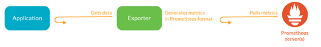
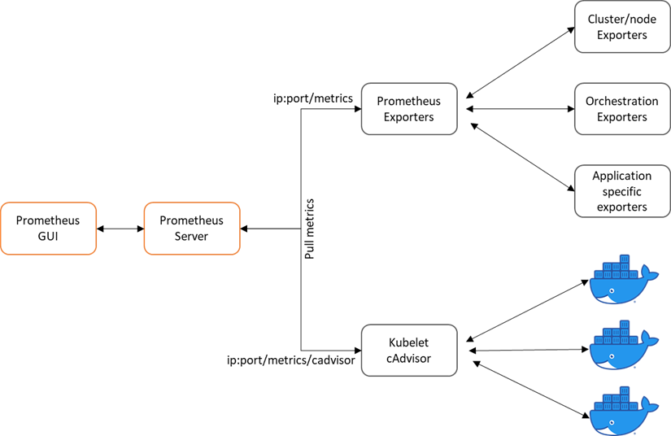
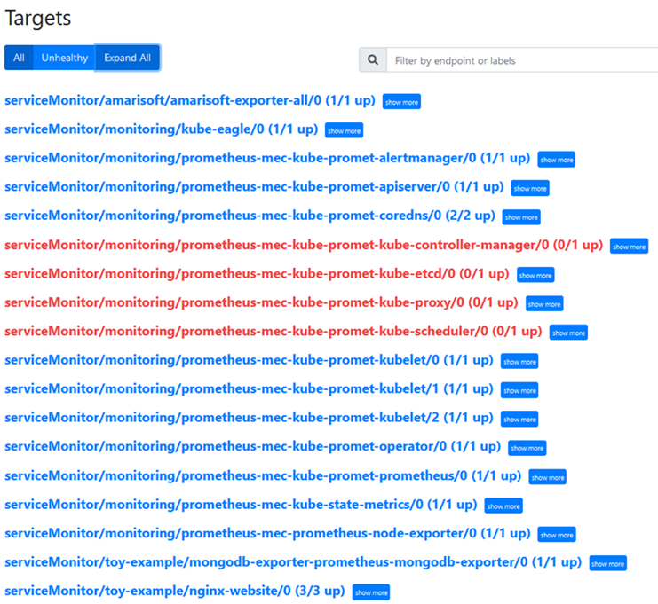
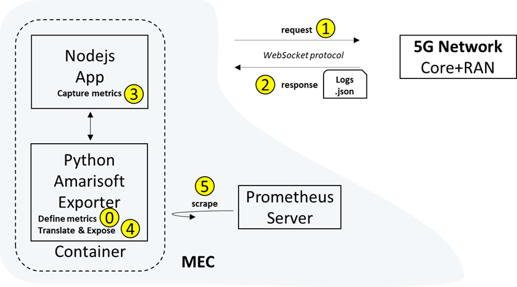
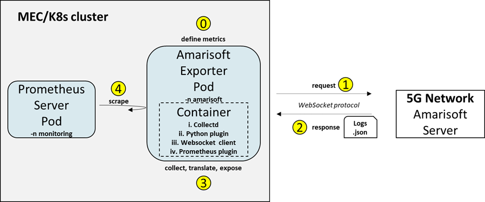
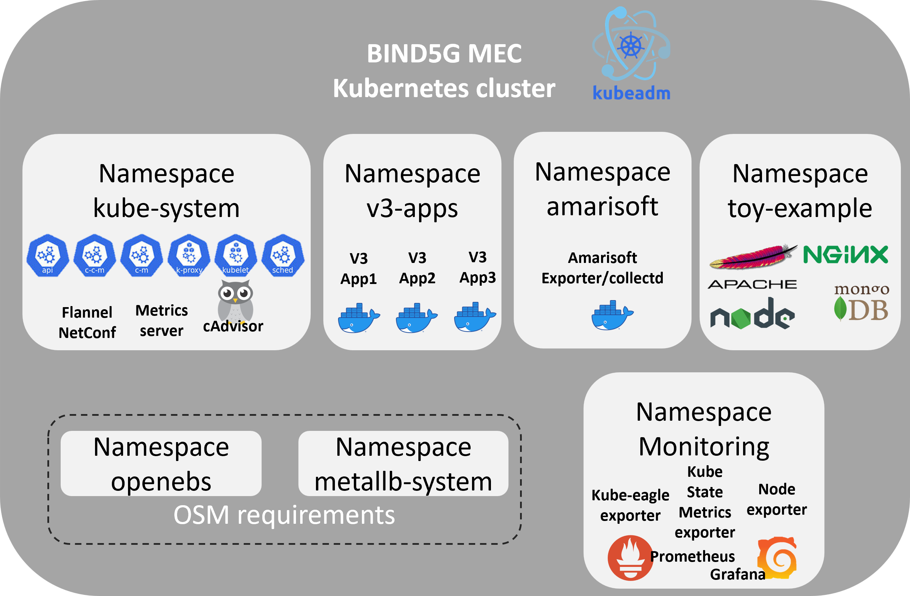
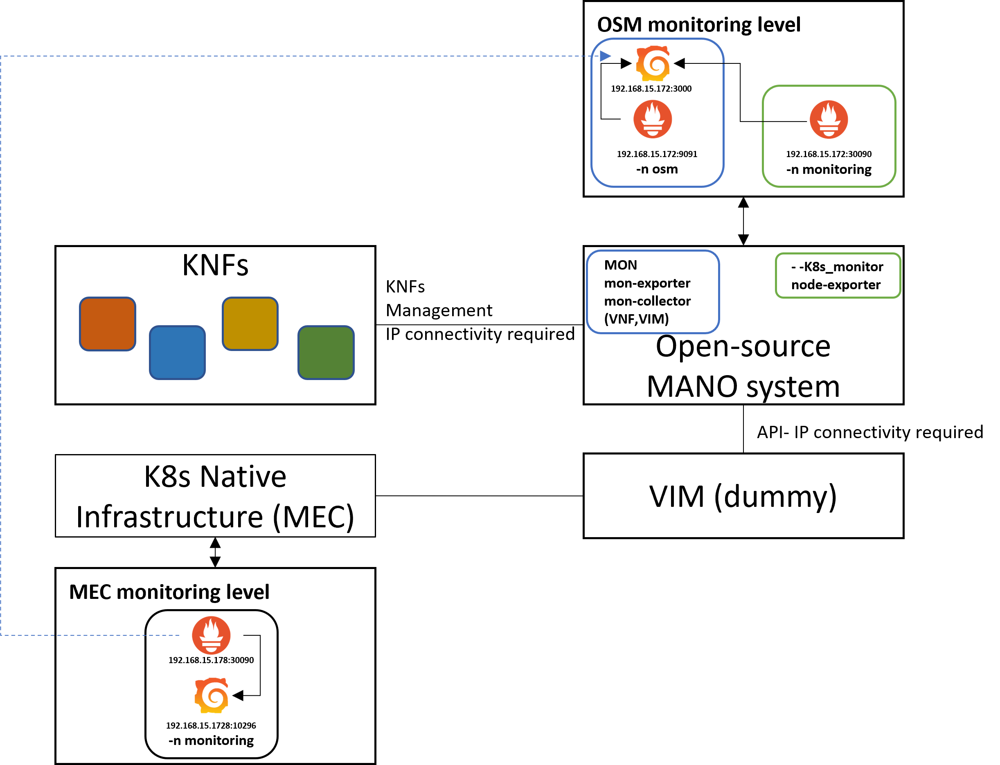
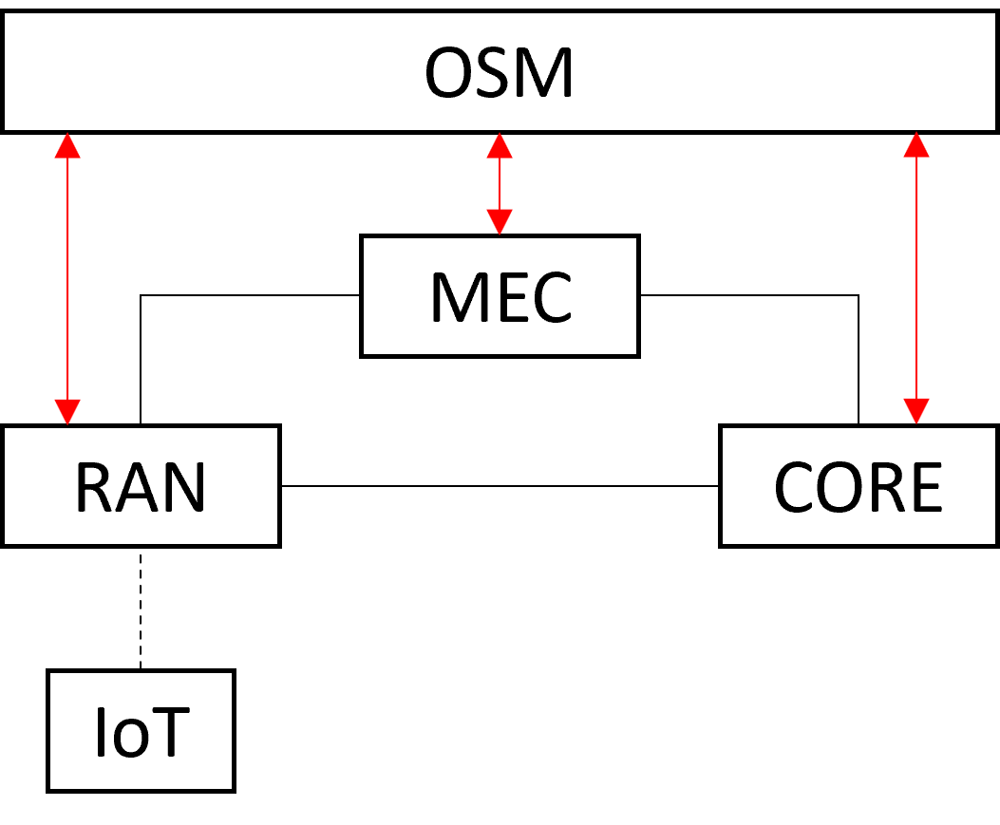

# MEC site with a K8s cluster and a Prometheus monitoring server

Basque Industry 5G (B-IND5G) project proposes a multi-access edge computing (MEC) use-case for the communication of IoT devices over a 5G network for the Industry4.0 vertical sector. The MEC site is a server and service provider closer to the end user (IoT) and implements an Industry4.0 management and orchestration (MANO) system to increase the performance by:
- hosting microservices (Applications containerized)
- monitoring infrastructure, applications and communication resources
- processing monitored metrics
- optimizing processed metrics
- scaling resources
- slicing networks and resources (edge-slicing)

The hosting of the applications is performed in a Kubernetes (K8s) cluster running in a virtual machine (VM) on top of an OpenStack private cloud server. The applications are containerized as Docker containers and are deployed in the K8s cluster as Pod instances. The K8s cluster consists of only one node with both master and worker functionalities, to simplify its deployment and is divided into seperated working spaces, called namespaces, to run applications in a better resource management manner. Prometheus, the monitoring tool of the whole infrastructure, is running as a Pod inside the cluster, in the namespace monitoring, and is responsible for monitoring the K8s cluster, Prometheus itself, and all the rest hosting applications. 

Moreover, Prometheus retrieves metrics from a 5G network, which complements the BIND5G architecture and provides the communication of the Industry4.0 IoT devices. The 5G network utilized by the project is an Amarisoft propietary solution and consists of two main components, the LTEENB and LTEMME, implemented entirely in software and running on a PC. LTEENB is an LTE/NR base station (eNodeB/gNodeB), while LTEMME is an LTE EPC (Evolved Packet Core)/NR 5GC (5G Core Network) implementation. The metrics are exposed to the Prometheus server with the help of an Amarisoft exporter running in the K8s cluster.

Finally, the K8s cluser is added to OSM, an open-source Management and Orchestration stack aligned with ETSI NFV Information Models. The purpose of this integration is for onboarding Kubernetes Network Functions (KNFs) orchestrated by OSM, from one hand side to scale MEC´s resources when it is necessary, and on the other hand side to slice the networks in order to build an infrastructure that is fully programmable, automated and designed for the Industry4.0 needs. 

Therefore, this document provides guidelines on how to set-up a K8s cluster and integrated it with OSM, and how to expose infrastructure, application and network type of metrics to a Prometheus server. 

The reader will be familiar with basic kubectl commands and will learn i) how to install, apply, delete, and edit Kubernetes manifest files, ii) how to get lists of Pods, Deployments, Services and Namespaces, iii) how to install and upgrade helm charts, iv) how to connect applications to a Prometheus server, v) understand how to monitor a K8s cluster and vi) learn basic osm commands to create a vim account and add a K8s cluster to OSM.

> **Note:** To follow this tutorial, a clean ubuntu distribution is needed either in a bare-metal machine or a virtual machine. Also, an IDE program needs to be installed in order to create and edit manifest files. Optionally to browse application GUIs, a browser needs to be installed as well.
   

# Set up a K8s cluster

A K8s cluster is composed of many nodes, which can be splitted into two types:

- The master node, which hosts the K8s control plane that controls and manages the whole K8s system
- The worker nodes that run the actual applications which are deployed

The more efficient way to a fully functioning Kubernetes cluster is by using kubeadm. kubeadm is a tool that sets up a single or multi-node cluster that is great for both testing Kubernetes and developing apps in bare-metal implementations. Also, it is a manual cluster installation that helps us to configure it in that way to be compliant with OSM. Other possible methods  to set up a K8s cluster can be found [here](https://itnext.io/kubernetes-installation-methods-the-complete-guide-1036c860a2b3) .

## Create a K8s cluster

To create a K8s cluster on a bare-metal or virtual machine, a container runtime, the kubelet, kubectl, and kubeadm tool must be installed. 

A container runtime, also known as container engine, is a software component that can run containers on a host operating system. Docker (Containerd) is the leading container system, offering a full suite of features, with free or paid options. It is the default Kubernetes container runtime, providing image specifications, a command-line interface (CLI) and a container image-building service. 

The kubelet, in Kubernetes, is an agent that runs on every computing node and receives commands specifying what containers should be running, and relays them to a container runtime on the node. It also collects information from the container runtime about currently running containers, and passes it back to the Kubernetes control plane.

kubectl is the command line tool for communicating with a Kubernetes cluster's control plane and kubeadm, as described above, is the tool to set-up a K8s cluster.

## Container runtime installation

 - [ ] Getting the Docker gpg key to install docker:

       curl -fsSL https://download.docker.com/linux/ubuntu/gpg | sudo apt-key add -

 - [ ] Add the Docker Ubuntu repository:

       sudo apt-get update
       sudo apt-get install ca-certificates curl gnupg lsb-release
       curl -fsSL https://download.docker.com/linux/ubuntu/gpg | sudo gpg --dearmor -o /usr/share/keyrings/docker-archive-keyring.gpg
       echo "deb [arch=$(dpkg --print-architecture) signed-by=/usr/share/keyrings/docker-archive-keyring.gpg] https://download.docker.com/linux/ubuntu $(lsb_release -cs) stable" | sudo tee /etc/apt/sources.list.d/docker.list > /dev/null

 - [ ] Update the packages:

       sudo apt-get update

 - [ ] Install docker and docker components:

       sudo apt-get install -y docker-ce docker-ce-cli containerd.io

## Kubernetes components installation (kubelet, kubectl, kubeadm)

 - [ ] Get the Kubernetes gpg key:

       curl -s https://packages.cloud.google.com/apt/doc/apt-key.gpg | sudo apt-key add -

 - [ ] Add the Kubernetes repository:

       cat << EOF | sudo tee /etc/apt/sources.list.d/kubernetes.list deb https://apt.kubernetes.io/ kubernetes-xenial main EOF

 - [ ] Update the packages:
    
       sudo apt-get update

 - [ ] Install kubelet, kubeadm, and kubectl with the latest or a
       specific version:

       sudo apt-get install -y kubelet=1.20.11-00 kubeadm=1.20.11-00 kubectl=1.20.11-00
   

 - [ ] Hold them at the current version:

       sudo apt-mark hold kubelet kubeadm kubectl

## kubeadm cluster initiation

 - [ ] Beforehand swappoff the swapp memory

	   sudo swapoff -a

 - [ ] Initialize the kubeadm cluster

	   sudo kubeadm init --pod-network-cidr=10.244.0.0/16

 - [ ] Set up local kubeconfig

	   mkdir -p $HOME/.kube
	   sudo cp -i /etc/kubernetes/admin.conf $HOME/.kube/config
	   sudo chown $(id -u):$(id -g) $HOME/.kube/config

> **Note:** In ~/.kube/config lies K8s cluster configuration file. This file will be neccessary later to add the K8s cluster to OSM

 - [ ] Apply Flannel CNI network overlay

	   kubectl apply -f https://raw.githubusercontent.com/coreos/flannel/master/Documentation/kube-flannel.yml

Since we want to follow an all-in-one node approach, we have to schedule pods in the master. 

 - [ ] Untaint the master:

	   kubectl taint nodes --all node-role.kubernetes.io/master-

## Cluster requirements for OSM integration
The K8s cluster to be added later on and integrates with OSM must fullfil the following requirements:

- installation and configuration of a load balancer for the cluster
- installation of a persistent volume storage (openebs) and define it as the default storageclass
- special permission of Tiller

Metallb is a very powerful, easy to configure, load balancer for kubernetes. 

 - [ ] Apply the following k8s manifest to install it in the cluster:

	   kubectl apply -f https://raw.githubusercontent.com/google/metallb/v0.8.3/manifests/metallb.yaml

After the installation, metallb has to be configured. The configuration of metallb in layer2 is via a Configmap kind manifest. Thus a configuration_metallb.yaml file has to be created (e.g in an IDE program) and has to be applied in the cluster
The configmap kind manifest looks like this:
```

apiVersion: v1

kind: ConfigMap

metadata:

namespace: metallb-system

name: config

data:

config: |

address-pools:

- name: default

protocol: layer2

addresses:

- 172.21.248.20-172.21.248.250

```
> **Note:** Visual studio code is an efficient IDE to syntax yaml manifests

 - [ ] Create the configuration_metallb.yaml file
 - [ ] Apply the file into the cluster:

	   kubectl apply -f configuration_metallb.yaml

> **Note:** We should ensure that the range of IP address defined in metallb are accessible from outside the cluster and is not overlapped with other devices in that network. Also this network should be reachable from OSM since OSM will need it to communicate with the cluster.

 - [ ] Next, apply a kubernetes persistent volume storage with the
       following manifest:

	   kubectl apply -f https://openebs.github.io/charts/openebs-operator.yaml

 - [ ] Check if there is a default storageclass in the cluster after
       the installation:

	   kubectl get storageclass
	   

 - [ ] Until now, there is not default storageclass defined.  Define
       openebs-hostpath as default storageclass with the command below:

       kubectl patch storageclass openebs-hostpath -p '{"metadata": {"annotations":{"storageclass.kubernetes.io/is-default-class":"true"}}}'

 - [ ] Confrim the default starageclass and check the results:

	   kubectl get storageclass

 - [ ] For Kubernetes clusters > 1.15 there is needed special permission
       of Tiller that can be added by the following command:

	   kubectl create clusterrolebinding tiller-cluster-admin --clusterrole=cluster-admin --serviceaccount=kube-system:default

> **Note:** It is possible the Tiller permission to be already configured in the latest versions of K8s.

## K8s cluster basic configuration

At this point we have a full-functioning K8s cluster. To obtain more information of the cluster, the running Nodes and Pods, we can execute the following commands. As we can see, all commands use kubectl, the command line communication tool for the K8s cluster.

 - [ ] Obtain information for the cluster

	   kubectl cluster-info

 - [ ] List the running Nodes (option `-o wide` gives more info)

	  `kubectl get nodes` or `kubectl get nodes -o wide`

 - [ ] List all the running Pods in all the Namespaces

	 `kubectl get pods --all-namespaces` or `kubectl get pods -A`

 - [ ] List the Namespaces of the cluster

	   kubectl get namespaces

 - [ ] Create a Namespace with a spesific name, for example bind5g

	   kubectl create namespace bind5g

 - [ ] Make a namespace the default working Namespace

	   kubectl config set-context --current --namespace=bind5g

 - [ ] By default the K8s cluster has already a Namespace called
       *default*. To return back to default Namespace we simply run again the same command:

	   kubectl config set-context --current --namespace=bind5g

 - [ ] Delete the Namespace bind5g

	   kubectl delete namespace bind5g

Additional docker related commands to obtain inormation for the containers running in the cluster (optional):

 - [ ] List the running containers

	   sudo docker ps

 - [ ] List the running and stopped containers

	   sudo docker ps -a

 - [ ] List containers filtered with a specific status

	   docker ps -f "status=exited"

# Manage a K8s cluster

To deploy toy-example applications in the cluster, we create a separate Namespace called *toy-example*.

 - [ ] Create namespace *toy-example*

	   kubectl create Namespace toy-example

 - [ ] Check the creation of toy-example Namespace:

	   kubectl get namespace

 - [ ] List the Pods under this Namespace:

	   kubectl get pods -n toy-example

> **Note:** As we havent deployed any pods yet, the output of this commnad will be no resources found in this namespace

Also, we create a folder for all the toy-example applications in the host machine with `mkdir toy-example` 

## Deploy a simple apache web application

First, we deploy a simple php-apache web application from an online yaml manifest file into the *toy-example* namespace:

 - [ ] Apply the php-apache web app into the cluster

	   kubectl apply -f https://k8s.io/examples/application/php-apache.yaml --namespace=toy-example

Next, we add load (infinite web requests) with another manifest file called infinity-calls.yaml. If we monitor later on the behaviour of this application with Prometheus the added load will provoke changes on the performance of the application. The manifest file of infinity-calls.yaml is described in the following code:

    apiVersion: apps/v1
    kind: Deployment
    metadata:
      name: infinite-calls-nginx
      labels:
        app: infinite-calls-nginx
    spec:
      replicas: 1
      selector:
        matchLabels:
          app: infinite-calls-nginx
      template:
        metadata:
          name: infinite-calls-nginx
          labels:
            app: infinite-calls-nginx
        spec:
          containers:
          - name: infinite-calls-nginx
            image: busybox
            command:
            - /bin/sh
            - -c
            - "while true; do wget -q -O- http://my-nginx; done"

 - [ ] Navigate into the toy-example folder in the machine

	   cd toy-example

 - [ ] Create and apply the infinite-calls.yaml to the cluster

	   kubectl apply -f infinite-calls-nginx.yaml --namespace=toy-example

 - [ ] Check the current running pods in the toy-example namespace

	   kubectl get pods -n toy-example

 - [ ] Check the deployment and service of the pod

	   kubectl get deployments -n toy-example
	   kubectl get service -n toy-example

## Deploy a simple mongodb application

 - [ ] Create the following manifest file with an IDE to toy-example
       folder

	    apiVersion: apps/v1
	    kind: Deployment
	    metadata:
	      name: mongodb-deployment
	      labels:
	        app: mongodb
	    spec:
	      replicas: 1
	      selector:
	        matchLabels:
	          app: mongodb
	      template:
	        metadata:
	          labels:
	            app: mongodb
	        spec:
	          containers:
	          - name: mongodb
	            image: mongo
	            ports:
	            - containerPort: 27017
	    ---
	    apiVersion: v1
	    kind: Service
	    metadata:
	      name: mongodb-service
	    spec:
	      selector:
	        app: mongodb
	      ports:
	        - protocol: TCP
	          port: 27017
	          targetPort: 27017 

 - [ ] Apply the manifest file to the K8s cluster

	   kubectl apply -f mongodb_app.yaml --namespace=toy-example
  
  

 - [ ] Check the pod, deployment and service of the mongodb application

	   kubectl get deployments -n toy-example
	   kubectl get service -n toy-example
	   kubectl get pods -n toy-example

## Deploy a simple nodejs Hello World application with 5 replicasets

In this part, we deploy a simple nodejs Hello World application that has only a Deployment Kubernetes kind in the manifest file and is configured to create 5 pods of the same application.

 - [ ] Apply it in the K8s cluster:

	   kubectl apply -f https://k8s.io/examples/service/load-balancer-example.yaml --namespace=toy-example
 
 

 - [ ] Check the Pod, Deployment, Service and Replicasets of the nodejs
       application

	   kubectl get deployments -n toy-example
	   kubectl get service -n toy-example
	   kubectl get pods -n toy-example
	   kubectl get replicasets -n toy-example
    
 We will notice that there is no Service related to this application. Every Deployment kind always creates a Pod (1 or more depending the value of Replicasets). To expose the application to the outside world a Service kind is needed.

 - [ ] Create a Service object that exposes the deployment:

	   kubectl expose deployment hello-world -n toy-example --type=LoadBalancer --name=my-nodejs-service
    
 > **Note:**  hello-world is the name of the Deployment and my-nodejs-service is the name of the Service
 
 > **Note:**  kubectl apply -f command creates and deployes a file which is either in the web (online in a repo) or in a host folder. To delete a deployed application we use `kubectl delete -f applicaition_name.yaml` When we want to delete a yaml file we deployed from the host computer we must be on the same folder this file exists. Then we can execute the kubectl delete command. 

# Monitor a K8s cluster

To monitor a K8s cluster and its running applications there are native and third party solutions. For example metrics-server lies under the native solutions while Prometheus is an open-source monitoring tool, which can be installed and deployed inside the cluster. 

## Native monitoring tools (metrics-server)

Metrics-server is a scalable, efficient source of container resource metrics for Kubernetes built-in autoscaling pipelines.

Metrics-server collects resource metrics from kubelets and exposes them in Kubernetes apiserver through [Metrics API](https://github.com/kubernetes/metrics) for use by [Horizontal Pod Autoscaler](https://kubernetes.io/docs/tasks/run-application/horizontal-pod-autoscale/) and [Vertical Pod Autoscaler](https://github.com/kubernetes/autoscaler/tree/master/vertical-pod-autoscaler/). Metrics API can also be accessed by `kubectl top`, making it easier to debug autoscaling pipelines.

 - [ ] Apply metrics-server in the cluster

	   kubectl apply -f https://github.com/kubernetes-sigs/metrics-server/releases/latest/download/components.yaml

 - [ ] Check metrics-server in the K8s cluster

	   kubectl get pods -n kube-system

 - [ ] If metrics-server is not working properly we have to edit the
       Deployment

	   kubectl edit deployment/my-nginx -n kube-system 

 - [ ] and add the `--kubelet-insecure-tls` line in the Deployment

	    spec:
	    
	    containers:
	    
	    - args:
	    
	    - --cert-dir=/tmp
	    
	    - --secure-port=4443
	    
	    - --kubelet-preferred-address-types=InternalDNS,InternalIP,ExternalDNS,ExternalIP,Hostname
	    
	    - --kubelet-insecure-tls 
	    
	    - --kubelet-use-node-status-port
    
        
Another way which is preferred is to configure the components.yaml file from the manifest, but first the initial metrics-server manifest must be deleted

 - [ ] Delete the metrics-server manifest file and then get (download) the file to your host machine

	   kubectl delete -f https://github.com/kubernetes-sigs/metrics-server/releases/latest/download/components.yaml
	   wget https://github.com/kubernetes-sigs/metrics-server/releases/latest/download/components.yaml

 - [ ] Open it with an IDE program. Edit the file by adding
       `--kubelet-insecure-tls` in the Deployment kind and Save it.

 - [ ] Apply it in the cluster:

	   kubectl apply -f components.yaml

 - [ ] Check whether the metrics-server app is installed by running the
       following command:

	   kubectl get pods --all-namespaces | grep metrics-server

 - [ ] Once metrics-server is properly installed, we can use it with

	   kubectl top pod
	   kubectl top node

This will show us metrics from all the Pods in the *default* Namespace and metrics from the Nodes.

## Monitoring with a Prometheus Server

A Prometheus server can be installed either as a binary or as a container. In a K8s cluster the easiest and most efficient way is through helm charts. Helm charts are a collection of Kubernetes manifest files, which make the installation of an application simpler.
[kube-prometheus stack](https://github.com/prometheus-operator/kube-prometheus) is a collection of Kubernetes manifests, Grafana dashboards, and Prometheus rules combined with documentation and scripts to provide easy to operate end-to-end Kubernetes cluster monitoring with [Prometheus](https://prometheus.io/) using the [Prometheus Operator](https://github.com/prometheus-operator/prometheus-operator).

 > **Note:** This chart was formerly named `prometheus-operator` chart, now renamed to more clearly reflect that it installs the `kube-prometheus` project stack, within which Prometheus Operator is only one component.

 - [ ] Installing Helm from binary releases:

	   wget https://get.helm.sh/helm-v3.6.2-linux-amd64.tar.gz
	   tar -zxvf helm-v3.6.2-linux-amd64.tar.gz
	   sudo mv linux-amd64/helm /usr/local/bin/helm
    

 - [ ] From there, we should be able to run some helm commands and add
       the stable repo:

	   helm help
	   helm repo add stable https://charts.helm.sh/stable
	   helm repo update
	   helm repo list
	   helm list

More installation methods of helm can be found [here](https://helm.sh/docs/intro/install/) .

Back to Prometheus kube-stack installation process, we will get the helm repository and install it.

 - [ ] Get Repo Info

	   helm repo add prometheus-community https://prometheus-community.github.io/helm-charts
	   helm repo update
	   helm install prometheus-mec prometheus-community/kube-prometheus-stack -n monitoring --create-namespace --set prometheus.service.type="LoadBalancer"

We notice that with the `helm install` command we can pass switches to configure the installation. With `-n monitoring` we declare to apply the prometheus stack in the *monitoring* Namespace, which we actually create it with the `--create-namespace` command. Also, we can set the Service type of Prometheus server as *LoadBalancer*. 

> **Note:** There are four types of Kubernetes Services — *ClusterIP, NodePort, LoadBalancer* and *ExternalName*. The type property in the Service's spec determines how the service is exposed to the network.

To change the Service from one type to another, for example from *LoadBalancer* to *NodePort*, we can upgrade the helm chart with `helm upgrade` command:

 - [ ] Upgrade helm chart

	   helm upgrade prometheus-mec prometheus-community/kube-prometheus-stack -n monitoring --set prometheus.service.type="NodePort" --set grafana.service.type="NodePort"

 - [ ] Check status with

	   kubectl --namespace monitoring get pods -l "release=prometheus-mec"

 - [ ] Obtain all the Kubernetes kinds in the *monitoring* Namespace with:

	   kubectl get all -n monitoring 

To find more information on how to access the GUI of Prometheus and Grafana, we can focus only on `kubectl get service` command and check the collumns TYPE, CLUSTER-IP and PORTS.

 - [ ] List services of *monitoring* Namespace

	   kubectl get service -n monitoring 

> **Note:** As we mentioned earlier there are four types of Services and one of the is *ClusterIP*. The collumn though CLUSTER-IP simply denotes the ip address of the Service regardless the Service type

> **Note:** If the Service type of a Pod or Deployment is *ClusterIP* we can browse this application through the hosts browser. In case we access the cluster remotely for example with ssh and floating ips, we have to change the type to *NodePort*, and to browse the application we use the floating ip and the *NodePort* port.

> **Note:** The credentials to access the Grafana GUI are username: admin and password: prom-operator

## Expose metrics to Prometheus with kube-eagle exporter

[Kube-eagle](https://github.com/cloudworkz/kube-eagle) is a prometheus exporter which exports various metrics of kubernetes pod resource requests, limits and it's actual usages. It was created with the purpose to provide a better overview of your kubernetes cluster resources, so that you can optimize the resource allocation. 
> **Note:** Metrics-server is a prerequisite for Kube Eagle to work. 

By using helm charts as in the Prometheus case we simplify the deployment of kube-eagle exporter.

 - [ ] Add helm repo and install it in *monitoring* Namespace

	   helm repo add kube-eagle https://raw.githubusercontent.com/cloudworkz/kube-eagle-helm-chart/master
	   helm repo update    
	   helm install kube-eagle kube-eagle/kube-eagle -n monitoring --create-namespace
	   helm upgrade kube-eagle kube-eagle/kube-eagle -n monitoring --set serviceMonitor.create=true --set serviceMonitor.releaseLabel=prometheus-mec

> **Note:** Check how Prometheus server auto-discovers kube-eagle exporter with the *release label prometheus-mec* in the ServiceMonitor section

Optionally, another way to configure the installation of a helm chart is through the values.yaml file. 
See how the values.yaml file looks like with the `helm show values` command following with the reponame and chart name:

    helm show values kube-eagle/kube-eagle

We can use the values.yaml file either with the `helm install` or with the `helm upgrade` command.

 - [ ] Run again the `helm show values` command  and save the output
       into a yaml file

	   helm show values kube-eagle/kube-eagle > values.yaml 

 - [ ] Edit the values.yaml file and apply it again in the cluster

	   helm upgrade kube-eagle kube-eagle/kube-eagle -n monitoring -f values.yaml

## Deploy Prometheus exporters for the applications of *toy-example* namespace

To monitor the mongodb application we deployed on the *toy-example* Namespace, we need application-specific Prometheus exporters. The Prometheus exporters are intermidiate programs which help us to expose the desired metrics to Prometheus server. These exporters translate the application metrics to Prometheus format and expose the metrics to endpoints. Then Prometheus server with the ServiceMonitor feature discovers the exporter and scrapes its endpoint to collect the metrics. A list of already implemented exporters can be found [here](https://prometheus.io/docs/instrumenting/exporters/) and the figure illustrates how Prometheus is scraping the exporters



 > **Note:** There are exporter installations with helm charts which makes it easier to be deployed. If an exporter does not come with a helm chart, we have to deploy and configure mannually the exporter in the cluster as we will see later on.

Lets add a mongodb exporter through a helm chart.

 - [ ] Show and save mongodb exporter´s value.yaml file
 
       helm show values prometheus-community/prometheus-mongodb-exporter > values.yaml
 
 - [ ] Edit it as follows

	    mongodb:
	      uri: "mongodb://mongodb-service:27017"
	    
	    serviceMonitor:
	      namespace: toy-example
	      additionalLabels:
	        release: prometheus-mec

 - [ ] Install it by passing the value.yaml file

	   helm install mongodb-exporter prometheus-community/prometheus-mongodb-exporter -f values.yaml --namespace=toy-example

Now, let us deploy an NGINX application with an NGINX exporter as a side-car container and deploy it mannualy in the cluster in the Namespace *toy-example*. 

 - [ ] Create the Deployment kind manifest file

	    apiVersion: apps/v1
	    kind: Deployment
	    metadata:
	      name: nginx-website
	      namespace: toy-example
	      labels:
	        app: website
	    spec:
	      replicas: 3
	      selector:
	        matchLabels:
	          app: website
	      template:
	        metadata:
	          labels:
	            app: website
	        spec:
	          containers:
	          - env:
	            image: quay.io/igou/igou.io-nginx:latest
	            imagePullPolicy: Always
	            name: igou-website
	            ports:
	            - containerPort: 80
	            livenessProbe:
	              httpGet:
	                scheme: HTTP
	                path: /
	                port: 80
	              initialDelaySeconds: 30
	              timeoutSeconds: 30
	            volumeMounts:
	            - mountPath: /etc/nginx/conf.d/nginx-status.conf
	              name: nginx-status-conf
	              readOnly: true
	              subPath: nginx.status.conf
	          - name: nginx-exporter
	            image: 'nginx/nginx-prometheus-exporter:0.3.0'
	            args:
	              - '-nginx.scrape-uri=http://localhost:8090/nginx_status'
	            ports:
	              - name: nginx-ex-port
	                containerPort: 9113
	                protocol: TCP
	            imagePullPolicy: Always
	          volumes:
	          - configMap:
	              defaultMode: 420
	              name: nginx-status-conf
	            name: nginx-status-conf

 - [ ] Create the Service kind manifest file

	    apiVersion: v1
	    kind: Service
	    metadata:
	      labels:
	        app: website
	      name: nginx-website
	      namespace: toy-example
	    spec:
	      ports:
	      - port: 80
	        protocol: TCP
	        targetPort: 80
	        name: http
	      - port: 9113
	        protocol: TCP
	        targetPort: 9113
	        name: metrics
	      selector:
	        app: website
	      sessionAffinity: None
	      type: ClusterIP

 - [ ] Create the ConfigMap kind manifest file

	    apiVersion: v1
	    data:
	      nginx.status.conf: |
	        server {
	            listen       8090 default_server;
	            location /nginx_status {
	                stub_status;
	                access_log off;
	            }
	        }
	    kind: ConfigMap
	    metadata:
	      name: nginx-status-conf
	      namespace: toy-example

 - [ ] Create the ServiceMonitor kind manifest file

	    apiVersion: monitoring.coreos.com/v1
	    kind: ServiceMonitor
	    metadata:
	      name: nginx-website
	      namespace: toy-example
	      labels:
	        release: prometheus-mec
	    spec:
	      selector:
	        matchLabels:
	          app: website
	      endpoints:
	      - port: metrics
	        interval: 30s


 > **Note:** Check how we connect the exporter with the Prometheus server with the additional label, *release: prometheus-mec* under the metadata section

With `---` inside a yaml file we can separete Kubernetes kinds and we can apply them by calling only one file. For example as we can see below in the same yaml manifest file igou_deployment_service.yaml, we have the Deployment and the Service kind.

    apiVersion: apps/v1
    kind: Deployment
    metadata:
      name: nginx-website
      namespace: toy-example
      labels:
        app: website
    spec:
      replicas: 3
      selector:
        matchLabels:
          app: website
      template:
        metadata:
          labels:
            app: website
        spec:
          containers:
          - env:
            image: quay.io/igou/igou.io-nginx:latest
            imagePullPolicy: Always
            name: igou-website
            ports:
            - containerPort: 80
            livenessProbe:
              httpGet:
                scheme: HTTP
                path: /
                port: 80
              initialDelaySeconds: 30
              timeoutSeconds: 30
            volumeMounts:
            - mountPath: /etc/nginx/conf.d/nginx-status.conf
              name: nginx-status-conf
              readOnly: true
              subPath: nginx.status.conf
          - name: nginx-exporter
            image: 'nginx/nginx-prometheus-exporter:0.3.0'
            args:
              - '-nginx.scrape-uri=http://localhost:8090/nginx_status'
            ports:
              - name: nginx-ex-port
                containerPort: 9113
                protocol: TCP
            imagePullPolicy: Always
          volumes:
          - configMap:
              defaultMode: 420
              name: nginx-status-conf
            name: nginx-status-conf
    
    ---
    
    apiVersion: v1
    kind: Service
    metadata:
      labels:
        app: website
      name: nginx-website
      namespace: toy-example
    spec:
      ports:
      - port: 80
        protocol: TCP
        targetPort: 80
        name: http
      - port: 9113
        protocol: TCP
        targetPort: 9113
        name: metrics
      selector:
        app: website
      sessionAffinity: None
      type: ClusterIP

 - [ ] Apply this manifest file to the cluster with

	   kubectl apply -f igou_deployment_service.yaml

 - [ ] Apply the configmap manifest file

	   kubectl apply -f igou_cm.yaml

 - [ ] Apply the servicemonitor  manifest file

	   kubectl apply -f igou_sm.yaml

## Monitoring general architectural flow in a K8s cluster with Prometheus

The figure below demonstrates the way metrics are exposed to a Prometheus server running in a K8s cluster



The exposed metrics can be classified into two categories

 - K8s cluster metrics 
	 - Metrics for monitoring K8s nodes such as classic sysadmin level metrics (through [node-exporter](https://docs.splunk.com/observability/gdi/prometheus-node/prometheus-node.html) or [kube-eagle](https://github.com/cloudworkz/kube-eagle)) cpu, load, memory, disk, etc.. 
	 - Orchestration level metrics (through [kube-state-metrics](https://github.com/kubernetes/kube-state-metrics/tree/master/docs)) like deployments, pods, replica status, nodes 
	 - Metrics for monitoring containers: Container resource level metrics (through [kubelet/cadvisor](https://github.com/google/cadvisor/blob/master/docs/storage/prometheus.md) and [kube-eagle](https://github.com/cloudworkz/kube-eagle)   
 - Specific application metrics
	 - Metrics exposed by specific exporters, which are either running a a side-car containers alongside the main application´s container or as a seperate deployment kind

  The figure below shows the list of the endpoints Prometheus server is scraping. Check the kube-eagle exporter, the NGINX exporter, the mongodb exporter, the node exporter from prometheus-stack, the kube-state-metrics from prometheus stack and kubelet/cadvisor a Kubernetes control plane component which is exposing container and hardware statistics as Prometheus metrics out of the box.
  
  

> **Note:** The Amarisoft exporter has not been deployed yet. This snapshot has been taken at the end of the tutorial. Thus, on the next section we will deploy the Amarisoft exporter and configure it to appear in the targets list. 


# Monitor an Amarisoft mobile network server

On behalf of BIND5G project the large-scale 5G Amarisoft network is exploited. The large-scale 5G Amarisoft network consists of the core, RAN and UE parts, all running in the same PC as a softwarized solution. Smartphones with 5G sim cards can also be connected to this 5G network. Also, part of the Amarisoft solution are a remote API to provide communication with the RAN and core part, and a GUI to monitor and visualize the status and performance of the network. As a result, there are three ways to monitor the 5G Amarisoft network:

 - Remote Api
 - Amarisoft server GUI
 - Amarisoft monitoring exporter

Bofore we start the monitoring phase, the Amarisoft server must be turned on and be configured either in Non-stand alone (NSA) or stand alone (SA) mode.

 - [ ] Connect to Amarisoft large scale network with ssh from a local
       terminal:

	   ssh user@192.168.15.209
	   password: *****
	   sudo su

 - [ ] Choose between NSA or SA mode through the Core-BS configuration
       procedure.

**NSA mode:**

 Core part:

    cd
    cd mme/config
    ln -sf mme-ims.cfg  mme.cfg

Base station part:

    cd
    cd enb/config
    ln -sf swallow_nsa.xml swallow.xml
    ln -sf gnb-nsa-dl-ul-slot-conf.cfg  enb.cfg

**SA mode:**

Core part:

    cd
    cd mme/config
    ln -sf mme-ims.cfg  mme.cfg

Base station part

    cd
    cd enb/config
    ln -sf swallow_sa.xml swallow.xml
    ln -sf gnb-sa.cfg  enb.cfg

Initiate the 5G network

 - [ ] Switch on the socket (V0 or V4)
 - [ ] Stop Radio Remote Head `service rmu stop`
 - [ ]  Reboot Amarisoft large-scale `service lte restart`
 - [ ] Verify the network has been deployed correctly `screen -x lte`
 - [ ] Choose eNB screen (Ctrl+a+n) `s1` for NSA, or `ng` for SA
 - [ ] To exit from screen (Ctrl+a+d) 
 - [ ] GUI access to check logs or to monitor and visualize Amarisoft server through the browser url: 192.168.15.209/lte
 - [ ] Terminate connection and network when your work is done `service lte stop`
 - [ ] Switch off the socket either from V0 or V4

## Monitor Amarisoft with Remote Api

Both Amarisoft EPC/5GC and ENB/gNB are providing communication via a remote API. The protocol used is WebSocket as defined in RFC 6455. The messages exchanged between the client and MME/ENB server are in strict JSON format. The APIs of both EPC and ENB are providing a plethora of messages (config_get, config_set, log_get, stats, ue_get, etc. …). More information can be found in the documentation core and basestation files.

From a local machine running a linux distro, we can request messages to the Amarisost server by running the remote node-js api (ws.js). First though we need to install node.js and websocket.

 - [ ] Install node.js and websocket with:

	   sudo apt update
	   sudo apt install nodejs
	   node -v
	   sudo apt install npm
	   npm -v
	   sudo npm install nodejs-websocket

Second, we need the ws.js application, which can be found in one of the folders of the Amarisoft server. 

 - [ ] Copy and paste it in a folder (amarisoft-websocket) in the
       machine that hosts the K8s cluster or any other machine with
       linux terminal:

	   scp user@192.168.15.209:/root/enb/doc/ws.js /home/ubuntu/amarisoft-websocket/

If the command failes due to security reasons, we can follow a reverse approach:

 - [ ] From the machine thar runs the Amarisoft server, copy the ws.js
       application and paste it in a temporary folder

	   cp /root/enb/doc/ws.js /tmp/

 - [ ] Change user ownership for the given file

	   chown user /tmp/ws.js

 - [ ] Copy the app from the Amarisoft server and paste it in the amarisoft-websocket folder to the machine that runs the K8s cluster or any other machine with linix terminal:

	   scp user@192.168.15.209:/tmp/ws.js /home/ubuntu/amarisoft-websocket

Then, we have to navigate to the folder where the ws.js application is `cd amarisoft-websocket`, and to request messages.

 - [ ] Request a config_get messages to gNB (5G Base Station):

	   ./ws.js 192.168.15.209:9001 '{"message": "config_get"}'

 

 - [ ] Request a config_get messagea to mme (5GCore):

	   ./ws.js 192.168.15.209:9000 '{"message": "config_get"}'

> **Note:** Other message-types we can request are: stats, ue_get, logs_get

> **Note:** Amarisoft server can handdle up to 31 simultaneusly websocket connections


## Amarisoft monitoring exporter

To retrieve communication metrics (core and radio) from the 5G network an [Amarisoft monitoring exporter](https://github.com/medianetlab/amarisoft-prometheus-exporter-collectd) is used.

The Amarisoft Radio monitoring is based on Prometheus and on another method called collectd. Collectd is a daemon which collects system and application performance metrics periodically and provides mechanisms to store the values in a variety of ways. The collectd daemon has implemented two plugins. The write_prometheus and the python plugin. The write_prometheus plugin is used to listen to queries from the Prometheus server, but also to translate the metrics to a form that can be read from the Prometheus server. The python plugin embeds a Python interpreter into the collectd and exposes the API to the python-scripts. We can name the Collectd alongside with the python plugin as the amarisoft exporter. 

In the amarisoft exporter there are two configuration files that define the IP addresses of the core and base station that need to be monitored. There are also implemented two python Scripts, one for the core and one for the base station that initiate a websocket connection with the Amarisoft server components.
> **Note:** The Amarisoft exporter used for the BIND5G project differentiates from the original one mentioned on the medianetlab repository on the defined metrics. The python scripts defining the metrics have been customized, with ws.close commands and more metric names.

## Run Amarisoft exporter in a local machine (optional)

As an optional step, before we deploy the Amarisoft exporter in the K8s cluster, we can deploy it and run it as a container and expose the metrics to another containerized Prometheus server outside of the K8s cluster. In this way, we can relate how containers and pods work. 



Also, we will demonstrate two ways to deploy the amarisoft exporter as a container, one with the `docker compose` command and the other with the `docker run` command.

1st way with the `docker compose` command:

 - [ ] Download amarisoft-exporter-application.tar.gz and extract the files

	   tar -xvzf amarisoft-exporter.tar.gz

 - [ ] Move to the plugins folder to edit the core and
       base station IPs

	   cd ~/amarisoft-prometheus-exporter-collectd_20220225/collectd/collectd/data/plugins

 - [ ] Configure the EPC list with the appropriate IP address of the
       Amarisoft server

	   vim epc_list.cfg

 - [ ] Configure the ENB list with the appropriate IP address of the
       Amarisoft server

	   vim enb_list.cfg

 - [ ] Change folder to collectd

	   cd collectd

 - [ ] Start the docker as a daemon

	   sudo docker-compose up -d

 - [ ] Amarisoft exporter is now running, verify metrics show up with:

	   curl http://localhost:9103/metrics

 - [ ] To stop and remove the container (do not stop it yet, as we need to expose metrics to Prometheus)

	   sudo docker-compose down

2nd way with the `docker run` command:

 - [ ] Download and extract the files as in 1st way

 - [ ] Move to the plugins folder to edit the core and
       base station IPs

	   cd ~/amarisoft-prometheus-exporter-collectd_20220225/collectd/collectd/data/plugins

 - [ ] Configure the EPC list with the appropriate IP address of the
       Amarisoft server

	   vim epc_list.cfg

 - [ ] Configure the ENB list with the appropriate IP address of the
       Amarisoft server

	   vim enb_list.cfg

 - [ ] Change folder to collectd

	   cd collectd

 - [ ] Run the container

	   sudo docker run -d -p 9103:9103 -v ${PWD}/data:/etc/collectd -v ${PWD}/data/types.db:/usr/share/collectd/types.db --name amarisoft-exporter-2 medianetlab/collectd

Let's move now to deploy the containerized prometheus server.
Running Prometheus on Docker is as simple as `docker run -p 9090:9090 prom/prometheus`

 - [ ] Run prometheus server

	   docker run -p 9090:9090 prom/prometheus

Prometheus to discover and scrape the containerized Amarisoft exporter has to be configured and a new job name category must be added on the prometheus.yaml file. This is the main configuration file, in which we declare which targets Prometheus scrapes. To edit this file we can do it by creating a file in our host machine and pasting it inside the container.

 - [ ] Create the following file:

	    # my global config
	    global:
		    scrape_interval: 15s # Set the scrape interval to every 15 seconds. Default is every 1 minute.
		    evaluation_interval: 15s # Evaluate rules every 15 seconds. The default is every 1 minute.
	      # scrape_timeout is set to the global default (10s).
	      # Alertmanager configuration
	    alerting:
		    alertmanagers:
			    - static_configs:
				    - targets:
						  # - alertmanager:9093
	    
	    # Load rules once and periodically evaluate them according to the global 'evaluation_interval'.
	    rule_files:
	    # - "first_rules.yml"
	    # - "second_rules.yml"
	    
	    # A scrape configuration containing exactly one endpoint to scrape:
	    # Here it's Prometheus itself.
	    scrape_configs:
	    # The job name is added as a label `job=<job_name>` to any timeseries scraped from this config.
	      - job_name: "prometheus"
	    # metrics_path defaults to '/metrics'
	    # scheme defaults to 'http'.
	        static_configs:
	          - targets: ["localhost:9090"]
	      - job_name: "collectd"
	        static_configs:
	          - targets: ["172.17.x.x:9103"]
         
  > **Note:** target IP is the targets-container IP, for example Amarisoft´s exporter container IP. Commands to obtain container´s IP are: `sudo docker exec dockerhive_namenode cat /etc/hosts`, and inside the container  `ifconfig`, `ip a`, `systemd-resolve --status | grep Current`, `ip -4 -o address`
  
 - [ ] Copy the newly locally created prometheus.yaml file to the
       container

	   sudo docker cp prometheus.yaml container_id:/etc/prometheus/prometheus.yaml

 - [ ] Or we can enter isnide the container and search for this file.

	   sudo docker exec –ti container_id sh
	   cd /etc/prometheus/prometheus.yaml

 - [ ] Add the following lines:

	    - job_name: 'collectd'
	      scrape_interval: 5s
	      static_configs:
		      - targets: ['172.17.x.x:9103']
        
   

 - [ ] Edit it with vi or another editor:

   vi prometheus.yaml

 - [ ] Restart Prometheus container to update the list of the discovered
       targets

	   sudo  killall -HUP Prometheus
> **Note:** The comand `sudo  killall -HUP Prometheus` we run it while we are inside the container

 - [ ] Finally access Prometheus GUI at localhost:9090 and check the
       targets

## Run Amarisoft exporter in a K8s cluster



 - [ ] Extract the files from amarisoft-exporter-application.tar.gz

       tar -xf amarisoft-exporter-application.tar.gz

 - [ ] Move to `~/amarisoft-prometheus-exporter-collectd_20220225/collectd/data/plugins`and edit the enb_list file with 192.169.15.209 IP and the epc_list file with 192.169.15.209 IP. The files can be eddited either with vim or with another editor.

 - [ ] Use the following manifest file amari_deployment_service_servicemonitor_all.yaml which contains the Deployment, the Service and the ServiceMonitor Kubernetes kind to deploy the Amarisoft exporter into the cluster

		apiVersion: apps/v1
		kind: Deployment
		metadata:
		  name: deployment-amarisoft-exporter-all
		  namespace: amarisoft
		  labels:
		    app: amari-exporter-all
		spec:
		  selector:
		    matchLabels:
		      app: amari-exporter-all
		  template:
		    metadata:
		      labels:
		        app: amari-exporter-all
		    spec:
		      containers:
		      - name: collectd-exporter
		        image: medianetlab/collectd
		        imagePullPolicy: Always
		        ports:
		        - containerPort: 9103
		        volumeMounts:
		        - mountPath: /etc/collectd
		          name: data-folder-all
		        - mountPath: /usr/share/collectd/types.db
		          name: types-file-all
		      restartPolicy: Always
		      volumes:
		      - name: data-folder-all
		        hostPath:
		          path: /home/ubuntu/amarisoft-prometheus-exporter-collectd_20220225/collectd/data
		          type: Directory
		      - name: types-file-all
		        hostPath: 
		          path: /home/ubuntu/amarisoft-prometheus-exporter-collectd_20220225/collectd/data/types.db
		          type: File

		---

		apiVersion: v1
		kind: Service
		metadata:
		  labels:
		    app: amari-exporter-all
		  name: service-amarisoft-exporter-all
		  namespace: amarisoft
		spec:
		  ports:
		  - port: 9103
		    protocol: TCP
		    targetPort: 9103
		    name: metrics
		  selector:
		    app: amari-exporter-all
		  type: ClusterIP

		---

		apiVersion: monitoring.coreos.com/v1
		kind: ServiceMonitor
		metadata:
		  name: amarisoft-exporter-all
		  namespace: amarisoft
		  labels:
		    release: prometheus-mec
		spec:
		  selector:
		    matchLabels:
		      app: amari-exporter-all
		  endpoints:
		  - port: metrics
		    interval: 5s

	

 - [ ] Create a folder called amarisoft_manifests, move into the folder,
       create the file there and apply it into the cluster

	   mkdir amarisoft_manifests
	   cd amarisoft_manifests
	   kubectl apply -f amari_deployment_service_servicemonitor_all.yaml

> **Note:** Servicemonitor kind is needed for Prometheus to auto-discover the Amarisoft export and to scrape it. This is achieved with the *release label prometheus-mec*

 - [ ] Check the Amarisoft exporter Pod, Deployment, Service and
       ServiceMonitor creation in the Namespace *amarisoft*

	   kubectl get pods -n amarisoft
	   kubectl get deployments -n amarisoft
	   kubectl get service -n amarisoft
	   kubectl get servicemonitor -n amarisoft

 - [ ] Confirm that Prometheus server from the *monitoring* Namespace
       discovers the exporter and also scrapes it by browsing Prometheus
       GUI -> Status -> Targets

 - [ ] Check that Amarisoft exporter is running properly through the
       logs, where amarisoft_exporter_pod_name is the name of the Amarisoft Pod from the `kubectl get pod -n amarisoft` command

	   kubectl logs <amarisoft_exporter_pod_name> -n amarisoft

Since pods are abstraction layers of containers we can see the same logs from the running container inside the od

 - [ ] Check container´s logs

	   sudo docker ps | grep collectd
	   sudo docker log <container_id>

 

## Amarisoft exporter retrieved metrics

The retrieved metrics from the **Core network** are:

- Number of UEs in EMM-REGISTERED or 5GMMREGISTERED state
- List of NGAP connections betweens RANs and AMF (PLMN, gNB, IP address and port of the RAN, List of the Tracking Areas served by the RAN, Number of UEs in 5GMM-CONNECTED state for this NGAP connection)
- Total downlink bytes in PDNs
- Total uplink bytes in PDNs
- UEs id in the CORE part
- 5GS QoS flow ID. Present for
- NR UEs.
- UEs id in the plmn
- UEs id in the radio part
- RAN id
- Currently registered users
- PDU session ID. Used for NR UEs
- Total downlink transferred bytes of bearers or PDU sessions
- Total uplink transferred bytes of bearers or PDU sessions

The retrieved metrics from the **RAN** are:

- LTE/5G NR frequency band indicator
- Cell gain in dB
- Downlink frequency
- Downlink EARFCN
- Downlink NR absolute radio frequency channel number
- Cell ID
- Maximum QAM size used in downlink
- Maximum QAM size used in uplink
- Number of downlink resource blocks
- Number of uplink resource blocks
- Number of antennas in the downlink
- Number of antennas in the uplink
- RF port number index
- NR ARFCN of the SSB carrier
- Uplink frequency
- Uplink EARFCN
- Uplink NR absolute radio frequency channel number
- PLMN identity part of the global gNB ID, gNB identity part of the global gNB ID, gNB name
- Total Cell throughput in Downlink (bit/sec)
- Total Cell throughput in Uplink (bit/sec)
- Number of downlink transmitted transport blocks (without retransmissions)
- Number of downlink retransmitted transport blocks
- Number of received uplink transport blocks (without CRC error)
- Number of received uplink transport blocks with CRC errors
- Number of ng connections
- RF port TX-RX average latency
- RF port TX-RX maximum latency
- RF port TX-RX minimum latency
- RF port TX-RX latency standard deviation
- RF CPU usage from the receiver
- Sample rate in MHz
- Maximum sample value for the received samples
- RMS sample value for the received samples
- Number of saturation events in the Tx side
- Maximum sample value for the sent samples
- RMS sample value for the sent samples
- Number of saturation events in the Rx side
- RF transmission frequency, in MHz
- Tx RF transmission gain, in dB
- RF reception frequency, in MHz
- Rx RF reception gain, in dB
- Number of connected users
- Downlink throughput per connected user
- Uplink throughput per connected user
- Channel quality indicator per connected user
- Energy per resource element in dBm per connected user
- Average downlink MCS per connected user
- Average uplink MCS per connected connected user
- SNR in dB per connected user
- Number of downlink retransmitted transport blocks per connected user
- Number of received uplink transport blocks with CRC errors per connected user
- Last reported rank indicator per connected user
- Average turbo/ldpc decoder pass per connected user
- Maximum turbo/ldpc decoder pass per connected user
- Minimum turbo/ldpc decoder pas per connected user
- Number of downlink transmitted transport blocks (without retransmissions) per connected user
- Number of received uplink transport blocks (without CRC error) per connected user
- Last computed UL path loss in dB, estimated from PHR per connected user
- Last received power headroom report. To retrieve the value in dB, refer to 3GPP 36.133 table 9.1.8.4

# OSM integration


## Installing OSM

[OSM installation](https://osm.etsi.org/docs/user-guide/03-installing-osm.html) is based on a K8s cluster deployment. OSM installer creates by default a K8s cluster and inside of it creates a Namespace *osm*. Under the Namespace *osm* lies OSM with its elements. Some of these elements are OSM CLI, OSM GUI, MON, Prometheus, and Grafana.

 - [ ] Commands for installing OSM:

	   wget https://osm-download.etsi.org/ftp/osm-11.0-eleven/install_osm.sh
	   chmod +x install_osm.sh
	   ./install_osm.sh

 - [ ] After the installation is finished, list all the OSM elements
       with:
   
	   kubectl get all -n osm

 - [ ] To browse into the OSM GUI with your preferred browser, use the
       IP of the output of the following command:

	   kubectl get service/ng-ui -n osm 

> **Note:** The credentials for the OSM GUI are username: admin, password: admin

## Monitoring an OSM installation

MON is an element to monitor VMs in NFVI and VNFs. The metrics from NFVI are collected through the VIM and the metrics from NFVs are collected through VCA (VNF Configuration and Abstraction). Metrics need to be defined on VNF descriptors for MON to collect them.

OSM installation can include add-ons (extra components), if options are added on the installation command. For example, to install OSM with the k8s_monitor add-on use the command  `./install_osm.sh --k8s_monitor`

> **Note:** It is suggested though by OSM community not to follow an OSM installation with the k8s_monitor add-on. It is advised users to follow the method that is described below

 - [ ] Install OSM without the monitoring option
 - [ ] Clone the master branch of the OSM devops repo

	   git clone http://osm.etsi.org/gerrit/osm/devops.git

 - [ ] Install the monitoring component

	   devops/installers/k8s/install_osm_k8s_monitoring.sh

 - [ ] Update the OSM Grafana configuration (name of a datasource)

       kubectl -n osm apply -f devops/installers/docker/osm_pods/grafana.yaml

 - [ ] Restart the Grafana pod to take changes

       export GRAFANA_POD=$(kubectl get pods -n osm -l "app=grafana" -o jsonpath="{.items[0].metadata.name}")
       kubectl -n osm delete pod $GRAFANA_POD

k8s_monitor add-on is for adding some components to monitor the K8s cluster hosting OSM, not VNFs or KNFs. You'll get those additional components in the *monitoring* Namespace, and not in the *osm* Namespace. It uses Prometheus operator, node exporter and other exporters for mysql and mongo. OSM without add-ons installation comes by default with another Prometheus server, and a Grafana instance (as pods) in the *osm* Namespace.

 - [ ] Check where Prometheus of *osm* Namespace is listening to and
       browse the GUI with your preferred browser

	   kubctl get service -n osm

 - [ ] Check where Grafana of *osm* Namespace is listening to and browse
       the GUI with your preferred browser

	   kubctl get service -n osm
	   
> **Note:** The credentials for Grafana GUI are username: admin, password: admin

 - [ ] Check where Prometheus of *monitoring* Namespace is listening to
       and browse the GUI with your preferred browser

	   kubctl get service -n monitoring

> **Note:** --k8s_monitor add-on installs another Prometheus server to monitor the cluster that hosts OSM in the *monitoring* namespace

## OSM configuration & integration with the K8s cluster

OSM ETSI framework can orchestrate virtual, containerized and hybrid network services. To achieve this VNFs and KNFs are needed. VNFs are running on VMs (or Virtual Deployment Units) and KNFs are running on containers (or Kubernetes Deployment Units). VMs are hosted/running in an NFVI and are managed by a virtual orchestration tool like Openstack (to be noted Openstack is more than that as it is a cloud operating system). Containers are hosted/running in a cloud native infrastructure (CNI) and are managed by a container orchestration tool like Kubernetes.

OSM ETSI framework interact with NVFI-VNFs and/or CNI-KNFs through another entity called VIM. Openstack itself can be considered as a VIM and can be added in the VIM list. Although Openstack itself can be considered as a VIM and can be added in the VIM list, a K8s cluster cannot. Thus, and to comply with OSM, a “Dummy” VIM must be created and listed. Therefore, an OSM-VIM(Dummy)-K8s connection is established with the following command on the OSM client: 

    osm vim-create --name bind5g-vim --user u --password p --tenant p --account_type dummy --auth_url http://localhost/dummy

where the options:
- -- name: Vim´s name, any name can be given
- --user: user´s name, any name can be given 
- --password: password´s name, any name can be given
- --tenant: tenant´s name, any name can be given
- --account_type: vim type, dummy name must be given
- --auth_url: vim´s url, a url has to be given even if it doesnt exist since dummy vim is not a phisical vim 

As a result, a K8s cluster can be deployed under or outside the VIM´s network. 

Under a VIM´s network the cluster is connected to OSM through the hosted VIM and is deployed following the instructions of Method 1 and 2 of [ANNEX 7: Kubernetes installation and requirements](https://osm.etsi.org/docs/user-guide/15-k8s-installation.html) of OSM´s official documentation.

Outside of the VIM´s network the cluster is connected to OSM through the Dummy VIM and is deployed as Annex 7, [Method 3: Manual cluster installation steps for Ubuntu](https://osm.etsi.org/docs/user-guide/15-k8s-installation.html).

Since, the K8s cluster of the MEC site is implemented following the Method 3, we can add the MEC/K8s cluster by executing the following command:

    osm k8scluster-add bind5g-cluster --creds /home/ubuntu/bind5g/k8s_cluster/config --vim bind5g-vim --k8s-nets '{k8s_net1: null }' --version 'v1.20.11' --description='K8s baremetal cluster’

where the options:
- --creds: path  to  k8s  config  file, the  /.kube/config file must be copied and pasted from the machine running the K8s cluster to the machine that runs OSM
- --vim: dummy vim´s name
- --k8s-nets: k8s_net1 is the name of K8s network and null is the nam eof the VIM´s network
- --version: verison of the K8s cluster, version of kubelet,kubectl,kubeadm
- --description: description of the K8s cluster

> **Note:** MEC/K8s cluster is where OSM will deploy KNFs, and it is NOT the K8s cluster on which OSM is installed

# Final remarks & future intentions

Following the above steps, the MEC site with the K8s cluster looks like this:



> **Note:** namespace v3_apps denotes the applications which will be installed in the next steps related to the IoT devices and the Optimizer which will process and optimize the metrics.

A graphical illustration of the integration of the MEC and the OSM alongside with their monitoring components of the BIND5G architecture is shown in the figure below:



- MEC listens to a VM with ip 192.168.15.178 of the small-scale Openstack server
- MEC-Prometheus server listens to a pod with ip 192.168.15.178:30090
- MEC-Grafana listens to a pod with ip 192.168.15.178:10296 and with the following credentials: user: admin, password: prom-operator
- Amarisoft exporter pod, which is running in MEC, is configured to connect with large-scale 5g network (192.168.15.209) to request core and radio metrics
- OSM-Prometheus pod listens to 192.168.15.172:9091 from Vicomtech´s internal network
- OSM-Grafana pod listens 192.168.15.172:3000 from Vicomtech´s internal network
- --k8s_monitor add-on installs another Prometheus server to monitor the cluster that hosts OSM in the monitoring namespace and this Prometheus pod Prometheus pod listens to 192.168.15.172:30090 from Vicomtech´s internal network

A high-level block representation with all the BIND5G components is presented here, where the red arrows show how OSM manages and orchestrates the whole arcitecture:



Functionalities such as auto-scalling K8s cluster resources with OSM and edge-slicing with KNFs will be discussed and described on the future, on an aupdated version of the current document. 


